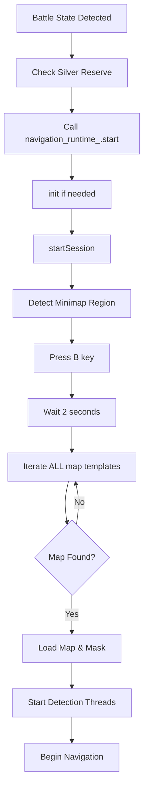
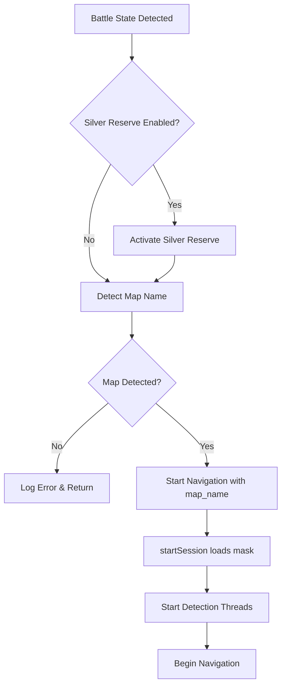

# Fix Battle State Initialization Flow

## Problem Summary

When the game enters battle state, the navigation system appears stuck in continuous minimap detection for 10+ seconds before properly starting. The logs show:

1. Battle state detected (08:24:45)
2. Continuous `self_arrow not found` messages for ~16 seconds
3. Map detection cycles through all templates (08:24:51-08:25:01)
4. Only then do worker threads start (08:25:01)

**Root Cause**: The `_handle_battle_state()` method calls `navigation_runtime_.start()`, which internally calls `startSession()`. This method blocks on map detection (pressing 'B', waiting 2s, iterating through templates) before starting detection threads.

## Current Flow Issues



**Problem**: Steps G-J block for 10-16 seconds while minimap detector may already be running in background, causing confusing logs.

## Proposed Solution

Restructure the battle state handler to follow the expected sequence:

1. **Check silver reserve** (if enabled)
2. **Detect map name** (before starting navigation runtime)
3. **Start navigation with known map name** (pass map_name to startSession)



## Implementation Changes

### 1. Modify [`src/core/battle_task.py`](src/core/battle_task.py)

**In `_handle_battle_state()` method (lines 242-263)**:

- Move silver reserve check to happen first
- Add explicit map detection step using `self.map_name_detector_`
- Pass detected map name to `navigation_runtime_.start(map_name)`
- Add proper error handling if map detection fails

**Key changes**:

```python
def _handle_battle_state(self) -> None:
    if self.battle_handled_:
        return

    logger.info("检测到战斗状态，开始初始化...")

    # Step 1: Activate silver reserve if needed
    if self._shouldActivateSilverReserve():
        self._activateSilverReserve()

    # Step 2: Detect map name BEFORE starting navigation
    logger.info("识别地图名称...")
    self.key_controller_.press('b')
    time.sleep(2)
    map_name = self.map_name_detector_.detect()
    self.key_controller_.release('b')
    
    if not map_name:
        logger.error("地图识别失败，无法启动导航")
        return
    
    logger.info(f"地图识别成功: {map_name}")

    # Step 3: Start navigation with known map name
    if not self.navigation_runtime_.start(map_name=map_name):
        logger.error("导航启动失败")
        return
    
    self.battle_handled_ = True
    logger.info("战斗状态处理完成")
```


### 2. Verify [`src/navigation/nav_runtime/navigation_runtime.py`](src/navigation/nav_runtime/navigation_runtime.py)

**No changes needed** - the `start()` method already supports passing `map_name`:

- Line 745-750: `start(map_name)` calls `startSession(map_name)`
- Line 301-312: `startSession()` skips map detection if `map_name` is provided

This ensures when map name is pre-detected, `startSession()` will:

- Skip the B-key press and template iteration
- Directly load the map and start threads
- Reduce startup time from 16s to ~2-3s

## Benefits

1. **Clear separation of concerns**: Silver reserve → Map detection → Navigation startup
2. **Faster startup**: Map detection happens once, not inside navigation init
3. **Better logging**: Each step is explicit and traceable
4. **Error handling**: Can fail gracefully if map detection fails before starting navigation
5. **Matches user's expected flow**: "1 检查银币，2 识别地图，设置对应的mask， 3 开始检测和控制运动"

## Testing Checklist

- [ ] Battle state triggers silver reserve (if enabled)
- [ ] Map name is detected and logged before navigation starts
- [ ] Navigation starts with correct map mask loaded