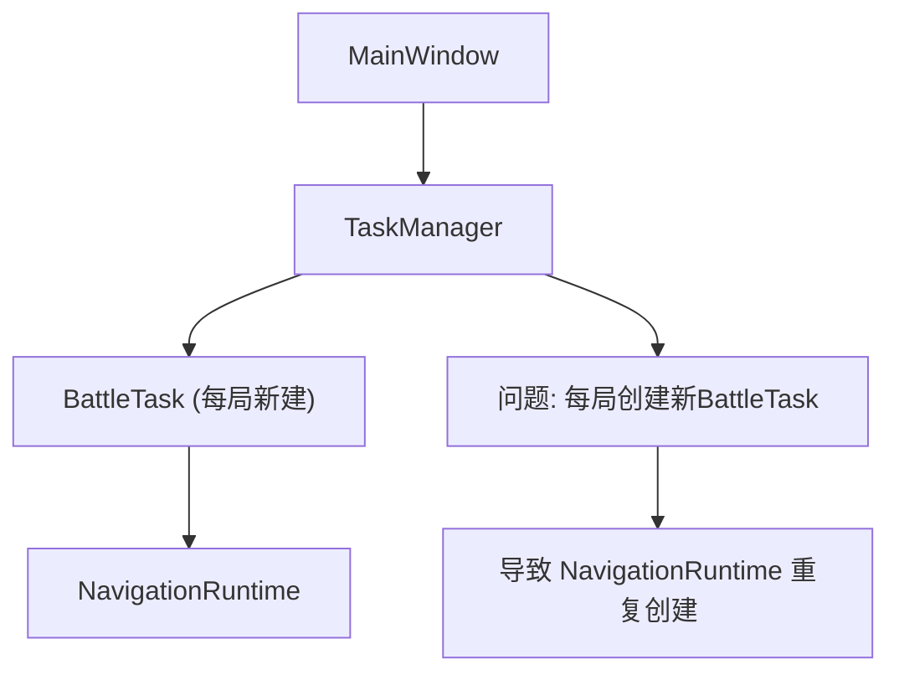
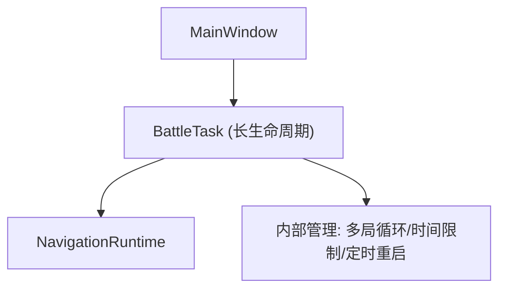

# 删除 Task

Manager 重构计划

## 当前架构问题



`TaskManager` 每局都创建新的 `BattleTask`，与 `NavigationRuntime` 的长生命周期设计冲突。

## 目标架构




## 改动概述

### 1. 修改 [src/core/battle_task.py](src/core/battle_task.py)

**新增构造参数：**

- `run_hours: int` - 运行时长限制（小时）
- `auto_stop: bool` - 达到时长后自动停止
- `auto_shutdown: bool` - 达到时长后自动关机

**新增成员变量：**

- `start_time_: datetime` - 启动时间
- `scheduled_restart_enabled_: bool` - 定时重启开关
- `scheduled_restart_hours_: float` - 定时重启间隔

**迁移方法：**

- `_should_stop()` - 检查时间限制
- `_should_scheduled_restart()` - 检查定时重启
- `_restart_program()` - 执行程序重启
- `_shutdown()` - 执行关机

**修改 `_event_loop()`：**

- 添加时间限制和定时重启检查（每次循环检测）
- 状态回到车库后自动继续下一局（无需外层循环）

### 2. 修改 [src/main_window.py](src/main_window.py)

**修改导入：**

```python
# 之前
from src.core.task_manager import TaskManager

# 之后
from src.core.battle_task import BattleTask
```

**修改 `_onStart()`：**

- 直接创建 `BattleTask` 而非 `TaskManager`
- 调用 `battle_task.start()` 而非 `task_manager.run_forever()`

**修改 `_onStop()`：**

- 调用 `battle_task.stop()` 而非 `task_manager.stop()`

### 3. 删除 [src/core/task_manager.py](src/core/task_manager.py)

## 关键代码片段

`BattleTask._event_loop()` 新增检查逻辑：

```python
while self.running_:
    # 1. 检查停止条件
    if self._shouldStop():
        logger.info("达到停止条件，退出循环")
        break
    
    # 2. 检查定时重启
    if self._shouldScheduledRestart():
        logger.info("达到定时重启时间")
        self._restartProgram()
        return
    
    # 3. 原有状态处理逻辑...


```