# WoT AI 架构文档

**版本**: 1.0  
**更新日期**: 2026-01-05

---

## 目录

1. [系统概述](#系统概述)
2. [整体架构](#整体架构)
3. [核心模块详解](#核心模块详解)
4. [数据流程](#数据流程)
5. [关键设计模式](#关键设计模式)
6. [性能优化要点](#性能优化要点)
7. [配置说明](#配置说明)
8. [扩展指南](#扩展指南)

---

## 系统概述

### 项目简介

**WoT AI** 是一个为《坦克世界》游戏设计的智能导航与自动化系统。通过计算机视觉、路径规划和运动控制技术，实现游戏内的自动导航、战斗循环和任务管理。

### 核心功能

- **视觉检测**: 基于 YOLO 的小地图实时检测（自身位置、朝向、敌方旗帜）
- **路径规划**: A* 算法 + 多级平滑优化（梯度平滑、Catmull-Rom 样条、LOS 简化）
- **运动控制**: 分层控制架构（决策层 + 执行层），支持路径跟随、卡顿检测、脱困
- **状态管理**: 游戏状态识别（车库/战斗/结算）+ 事件驱动任务调度
- **调试工具**: 实时可视化调试界面（DearPyGui）、配置热加载

### 技术栈

| 层次 | 技术 |
|------|------|
| **界面** | Tkinter（主控）, DearPyGui（调试） |
| **视觉** | YOLOv8, OpenCV, Ultralytics |
| **规划** | A* 搜索, Catmull-Rom 样条, RDP 简化 |
| **控制** | 键盘模拟（pynput）, 平滑滤波 |
| **配置** | YAML, Pydantic |
| **依赖管理** | Poetry |

### 运行环境

- **操作系统**: Windows 10/11
- **Python**: 3.11
- **GPU**: CUDA 支持（推荐 CUDA 12.1+）
- **内存**: 建议 8GB+（YOLO 模型常驻）

---

## 整体架构

### 分层架构

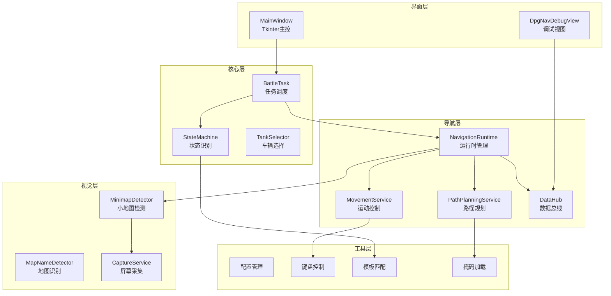

### 线程模型

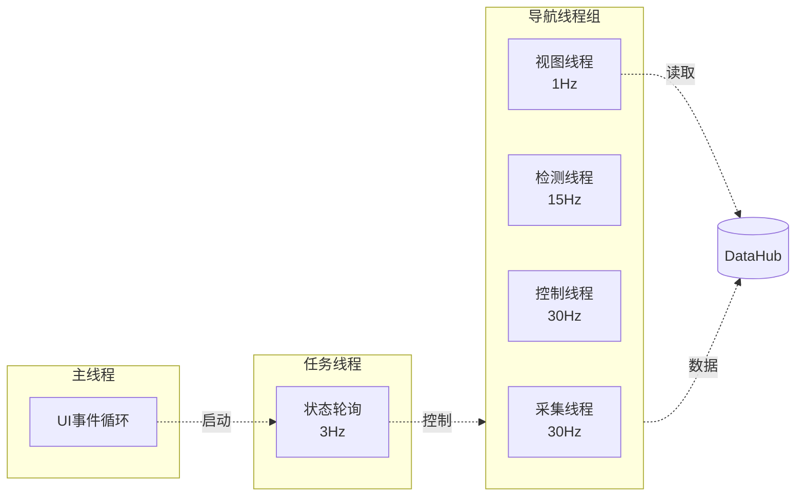

---

## 核心模块详解

### 3.1 界面层

#### MainWindow (`src/main_window.py`)

**职责**: 主控界面，提供用户交互入口

**核心功能**:
- 车辆截图管理（优先级排序）
- 任务启动/停止控制
- 银币储备设置
- 自动停机配置
- 日志监控

**关键方法**:
```python
def _startBattleTask() -> None    # 启动自动化任务
def _stopBattleTask() -> None     # 停止任务
def _loadVehicleImages() -> None  # 加载车辆截图
```

#### DpgNavDebugView (`src/gui/debug_view.py`)

**职责**: 实时调试视图，可视化导航状态

**显示内容**:
- 小地图检测结果（位置、朝向、旗帜）
- 规划路径（网格 + 世界坐标）
- 障碍地图（栅格化 + 代价图）
- 运动状态（速度、转向、模式）

---

### 3.2 核心层 (`src/core/`)

#### StateMachine (`state_machine.py`)

**职责**: 游戏状态识别与转换

**状态枚举**:
```python
class GameState(Enum):
    IN_GARAGE = "in_garage"    # 车库
    IN_BATTLE = "in_battle"    # 战斗中
    IN_END = "in_end"          # 结算页
    UNKNOWN = "unknown"        # 未知
```

**关键机制**:
- **模板匹配**: 基于预设模板识别当前状态
- **稳定性检查**: 连续 N 帧确认才切换状态（防抖）
- **单例模式**: 全局唯一实例

#### BattleTask (`battle_task.py`)

**职责**: 事件驱动的自动化任务调度

**核心流程**:
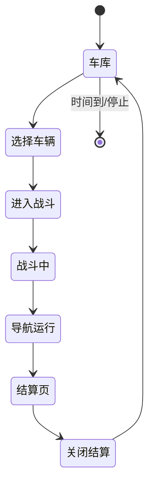

**关键方法**:
```python
def _handleGarage() -> None     # 处理车库状态：选车、启动
def _handleBattle() -> None     # 处理战斗状态：启动导航
def _handleEnd() -> None        # 处理结算状态：关闭界面
def _checkTimeLimit() -> bool   # 检查运行时长
```

#### TankSelector (`tank_selector.py`)

**职责**: 车辆选择与优先级管理

**选择策略**:
1. 按文件名排序（`1.png` > `2.png` > `3.png`）
2. 模板匹配查找车辆
3. 点击选中，滚动查找下一辆

---

### 3.3 导航层 (`src/navigation/`)

#### NavigationRuntime (`nav_runtime/navigation_runtime.py`)

**职责**: 导航系统的生命周期管理器

**架构特点**:
- **长生命周期资源**: 模型、UI、服务在启动时加载，跨局复用
- **短生命周期会话**: 每局创建新 `NavigationSession`，局结束销毁
- **线程管理**: 统一管理采集、检测、控制、视图线程

**生命周期**:
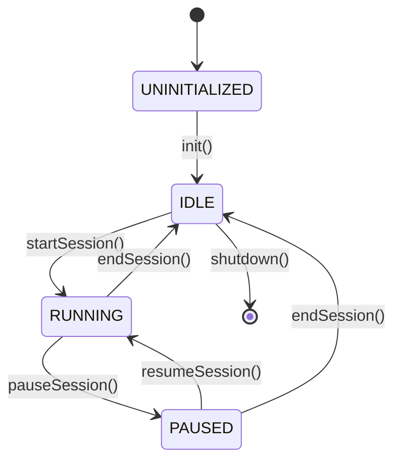

**关键方法**:
```python
def init() -> bool                          # 初始化长生命周期资源
def startSession(map_name) -> bool          # 开始新局（检测地图、启动线程）
def endSession() -> None                    # 结束当前局（清理 CUDA、重置状态）
def shutdown() -> None                      # 释放所有资源
```

#### PathPlanningService (`path_planner/path_planning_service.py`)

**职责**: 路径规划服务门面

**规划流程**:
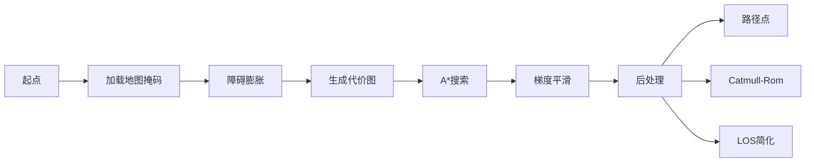

**关键组件**:
- **AStarPlanner**: A* 搜索 + 梯度平滑
- **CatmullRom**: 样条曲线插值
- **PathSimplify**: RDP/LOS 简化

**配置参数**（`path_planning`）:
```yaml
enable_astar_smoothing: true       # A*内部平滑
astar_smooth_weight: 0.15          # 平滑权重（0.15-0.5窄路）
post_smoothing_method: catmull_rom # 后处理方法
simplify_threshold: 2              # 简化阈值
```

#### MovementService (`controller/movement_service.py`)

**职责**: 运动控制层门面

**控制架构**:
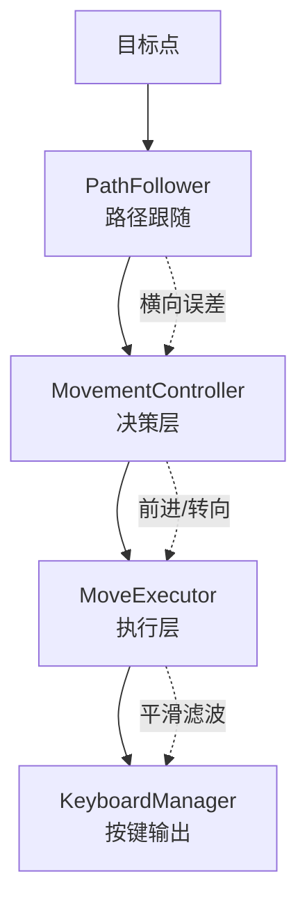

**分层设计**:
1. **PathFollower**: 计算横向误差、前瞻点
2. **MovementController**: 纯函数决策（无状态），输出连续控制量
3. **MoveExecutor**: 状态管理、平滑滤波、键盘映射
4. **KeyboardManager**: 底层按键控制

**关键参数**（`control`）:
```yaml
lookahead_distance: 12.0          # 前瞻距离
max_lateral_error: 3.0            # 横向误差容忍
angle_dead_zone_deg: 3.0          # 舵角死区
smoothing_alpha_forward: 0.2      # 前进平滑系数
smoothing_alpha_turn: 0.6         # 转向平滑系数
```

#### StuckDetector (`nav_runtime/stuck_detector.py`)

**职责**: 卡顿检测与脱困

**检测逻辑**:
```python
# 固定时间间隔检测
时间窗口 = 15秒
if 累计移动距离 < 阈值(3像素):
    判定卡顿 → 倒退脱困
```

**脱困策略**:
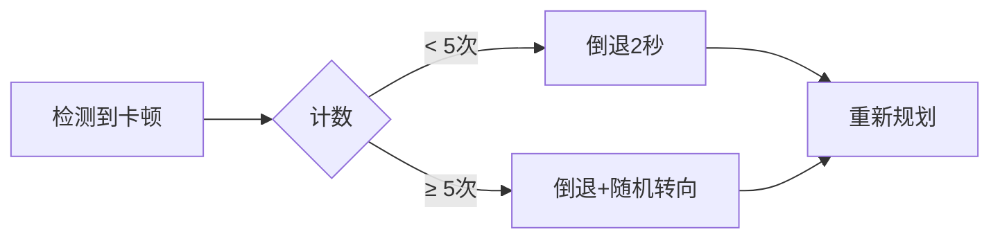

#### DataHub (`service/data_hub.py`)

**职责**: 线程安全的数据总线

**数据结构**:
```python
@dataclass
class PathSnapshot:
    grid: List[Tuple[int, int]]         # A* 网格路径
    world: List[Tuple[float, float]]    # 世界坐标路径
    target_idx: int                     # 当前目标点索引

@dataclass
class NavStatus:
    is_stuck: bool                      # 卡顿状态
    path_deviation: float               # 路径偏离
    distance_to_goal: float             # 距终点距离
    goal_reached: bool                  # 到达终点
```

**线程安全**:
- 使用 `threading.Lock` 保护共享数据
- 检测帧带时间戳，支持 `max_age` 过滤

---

### 3.4 视觉层 (`src/vision/`)

#### MinimapDetector (`minimap_detector.py`)

**职责**: 小地图实时检测

**双模型架构**:
1. **base_model**: 检测箭头 + 敌方旗帜（全图）
2. **arrow_model**: 细化箭头朝向（关键点检测）

**检测流程**:
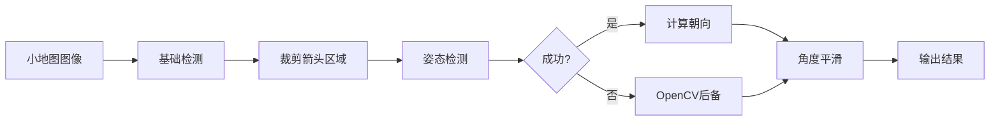

**失败样本保存**:
- 检测失败时自动保存（用于模型训练）
- 冷却机制：每 10 秒最多保存一次

#### MapNameDetector (`map_name_detector.py`)

**职责**: 地图名称识别

**识别方法**:
1. 模板匹配（优先）
2. OCR 识别（后备）

#### MinimapAnchorDetector (`minimap_anchor_detector.py`)

**职责**: 小地图区域定位

**检测方法**:
- 边框检测（`minimap_border.png`）
- 缓存结果，跨局复用

---

### 3.5 工具层 (`src/utils/`)

#### 配置管理

- **global_path.py**: 全局配置单例 `GetGlobalConfig()`
- **global_context.py**: 全局上下文管理
- **config/loader.py**: YAML 配置加载器
- **config/models.py**: Pydantic 配置模型（类型验证）

#### 键盘控制

- **KeyController**: 高层键盘接口（`press("w")`, `release("w")`）
- **KeyboardManager**: 底层按键管理（状态跟踪、防抖）

#### 其他工具

- **TemplateMatcher**: 模板匹配服务
- **MaskLoader**: 地图掩码加载与处理
- **AngleSmoother**: 自适应角度平滑（抑制噪声、加速大转向）

---

## 数据流程

### 帧采集与检测流程

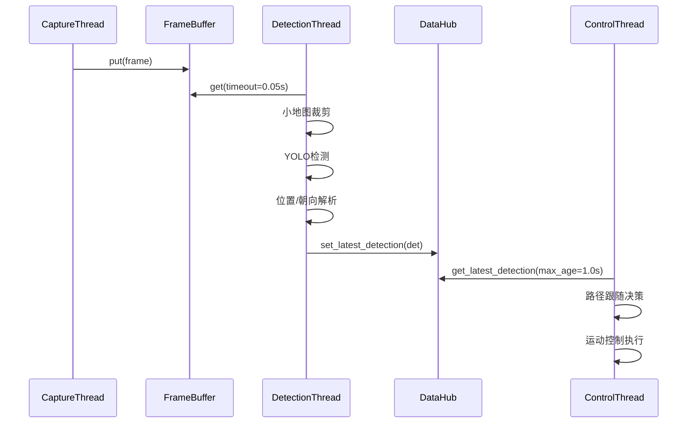

### 路径规划流程

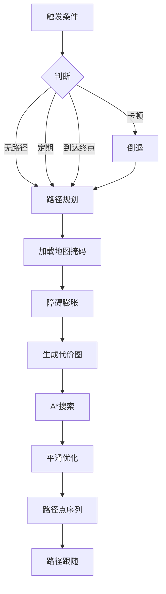

### 运动控制流程

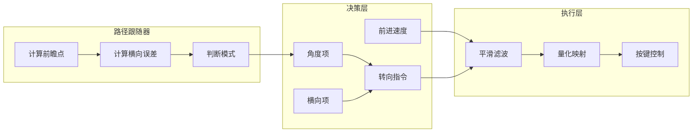

---

## 关键设计模式

### 1. Facade 模式

**使用场景**: 简化复杂子系统接口

**示例**:
- **PathPlanningService**: 封装 A*、平滑、简化等复杂逻辑
- **MovementService**: 封装决策、执行、键盘控制

**优势**: 外部只需调用简单接口，内部实现可灵活调整

### 2. Strategy 模式

**使用场景**: 可配置的算法切换

**示例**:
- 平滑方法：`catmull_rom` / `los`
- 简化方法：`rdp` / `los` / `none`

**配置**:
```yaml
path_planning:
  post_smoothing_method: "catmull_rom"  # 策略选择
  simplify_method: "rdp"
```

### 3. Observer 模式

**使用场景**: 多线程数据共享

**示例**: `DataHub` 作为数据总线
- 检测线程写入 → `set_latest_detection()`
- 控制线程读取 → `get_latest_detection()`
- 视图线程订阅 → `get_current_path()`

### 4. Session 模式

**使用场景**: 资源生命周期管理

**设计**:
```python
# 长生命周期（跨局复用）
NavigationRuntime.init()  
    ├── MinimapDetector（YOLO模型常驻）
    ├── PathPlanningService（地图掩码缓存）
    └── MovementService（控制器实例）

# 短生命周期（单局）
NavigationSession
    ├── 当前路径
    ├── 目标索引
    └── 地图名称
```

**优势**: 避免重复加载模型，减少启动延迟（~2-3秒）

### 5. Singleton 模式

**使用场景**: 全局唯一实例

**示例**:
- `StateMachine`: 游戏状态管理
- `GetGlobalConfig()`: 配置单例

---

## 性能优化要点

### 1. 模型复用

**策略**: YOLO 模型在 `init()` 加载，跨局复用

**效果**: 
- 首次启动 ~2-3秒
- 后续启动 <0.5秒

**实现**:
```python
# NavigationRuntime.init() 只调用一次
self.minimap_detector_ = MinimapDetector()
self.minimap_detector_.LoadModel()  # 模型常驻
```

### 2. 区域缓存

**策略**: 小地图区域检测一次，全局缓存

**效果**: 避免每局重复检测（节省 ~1秒）

**实现**:
```python
# 首次检测
self.minimap_region_ = detector.DetectRegion(frame)

# 后续复用
session.minimap_region_ = self.minimap_region_
```

### 3. Cost Map 优化

**策略**: 使用代价图引导 A* 远离障碍

**效果**: 路径更安全，减少卡顿

**实现**:
```python
cost_map = 1 + exp(alpha * distance_transform(obstacles))
path = astar_with_cost(cost_map, start, goal)
```

### 4. 线程分频

**策略**: 不同任务使用不同频率

| 线程 | 频率 | 说明 |
|------|------|------|
| 采集 | 30 Hz | 保证帧新鲜度 |
| 检测 | 15 Hz | 平衡性能与延迟 |
| 控制 | 30 Hz | 平滑运动 |
| 视图 | 1 Hz | 减少渲染开销 |

### 5. CUDA 缓存清理

**策略**: 每局结束清理 CUDA 缓存

**效果**: 防止显存泄漏

**实现**:
```python
def endSession():
    torch.cuda.empty_cache()
    gc.collect()
```

---

## 配置说明

### 核心配置项

#### 路径规划 (`path_planning`)

```yaml
enable_astar_smoothing: true       # A*内部平滑（推荐开启）
astar_smooth_weight: 0.15          # 平滑权重：窄路0.15-0.5，宽路0.4-0.6
post_smoothing_method: catmull_rom # 后处理：catmull_rom=曲线，los=直线
simplify_threshold: 2              # 简化阈值：小(2-6)=保守，大(>8)=激进
curvature_threshold_deg: 30.0      # 曲率阈值：小=提前减速，大=允许急弯
```

**调优建议**:
- 窄路（12-15px）: `astar_smooth_weight: 0.15`, `simplify_threshold: 2`
- 宽路（20px+）: `astar_smooth_weight: 0.5`, `simplify_threshold: 6`

#### 运动控制 (`control`)

```yaml
lookahead_distance: 12.0           # 前瞻距离：大=平滑，小=贴点
max_lateral_error: 3.0             # 横向容忍：大=宽松，小=严格
angle_dead_zone_deg: 3.0           # 舵角死区：大=抗噪，小=灵敏
max_forward_speed: 1.0             # 最大速度：可降低以更谨慎
min_forward_factor: 1.0            # 最小速度：1.0=不减速，0.3=允许大幅减速
```

**调优建议**:
- 激进：`lookahead: 15`, `max_lateral_error: 5`, `max_forward_speed: 1.0`
- 保守：`lookahead: 10`, `max_lateral_error: 2`, `max_forward_speed: 0.7`

#### 卡顿检测 (`stuck_detection`)

```yaml
time_window_s: 15.0                # 检测窗口：大=耐心，小=快速判断
dist_threshold_px: 3.0             # 位移阈值：大=不易卡顿，小=敏感
reverse_duration_s: 5.0            # 倒退时长：大=退得远，小=快速恢复
max_stuck_count: 5                 # 连续卡顿次数：超过则随机转向
```

#### 定期重规划 (`periodic_replan`)

```yaml
enable: true                       # 是否启用定期重规划
interval_s: 5.0                    # 重规划间隔：大=省资源，小=路径更新频繁
```

**效果**: 实时更新路径，修正累积误差

---

## 扩展指南

### 添加新地图掩码

1. **生成掩码图像**:
   - 分辨率与栅格配置一致（默认 512x512）
   - 黑色 = 可通行，白色 = 障碍

2. **命名规则**:
   ```
   resource/map_mask/{地图名}_mask.png
   ```

3. **验证**:
   ```bash
   poetry run pytest utest/test_path_plan.py
   ```

### 调整路径规划参数

**场景 1: 路径贴障碍太近**
```yaml
mask:
  inflation_radius_px: 3           # 增大膨胀半径（默认1）
  
path_planning:
  astar_smooth_weight: 0.2         # 减小平滑权重（避免过度平滑）
```

**场景 2: 路径太绕远**
```yaml
path_planning:
  astar_smooth_weight: 0.5         # 增大平滑权重
  simplify_threshold: 6            # 增大简化阈值
```

**场景 3: 急弯过不去**
```yaml
control:
  lookahead_distance: 8.0          # 减小前瞻距离
  large_angle_speed_reduction: 0.5 # 大角度时减速
```

### 添加新游戏状态

1. **扩展状态枚举** (`src/core/state_machine.py`):
   ```python
   class GameState(Enum):
       IN_GARAGE = "in_garage"
       IN_BATTLE = "in_battle"
       IN_END = "in_end"
       IN_LOADING = "in_loading"  # 新增
   ```

2. **添加模板** (`resource/template/{分辨率}/hub/`):
   ```
   in_loading.png
   ```

3. **更新状态机逻辑**:
   ```python
   def detect(self, frame) -> GameState:
       # ... 现有逻辑 ...
       if self._matchTemplate(frame, "in_loading.png"):
           return GameState.IN_LOADING
   ```

4. **处理新状态** (`src/core/battle_task.py`):
   ```python
   def _handleLoading(self) -> None:
       logger.info("处理加载页...")
       time.sleep(1)  # 等待加载完成
   ```

### 集成新检测模型

1. **放置模型文件** (`resource/model/`):
   ```
   new_model.pt
   ```

2. **更新配置** (`config/config.yaml`):
   ```yaml
   model:
     base_path: "resource/model/new_model.pt"
     conf_threshold: 0.3
   ```

3. **验证模型兼容性**:
   ```bash
   poetry run pytest utest/test_yolo_interface.py
   ```

---

## 附录

### 目录结构

```
wot_ai/
├── config/                 # 配置文件
│   ├── config.yaml         # 主配置
│   └── AGENTS.md           # 配置说明
├── doc/                    # 文档
│   └── ARCHITECTURE.md     # 架构文档（本文档）
├── resource/               # 资源文件
│   ├── model/              # YOLO 模型
│   ├── map_mask/           # 地图掩码
│   └── template/           # UI 模板
├── src/                    # 源代码
│   ├── core/               # 核心层
│   ├── navigation/         # 导航层
│   ├── vision/             # 视觉层
│   ├── gui/                # 界面层
│   └── utils/              # 工具层
├── utest/                  # 测试用例
├── Logs/                   # 运行日志
├── pyproject.toml          # 项目配置
└── README.md               # 项目说明
```

### 参考资源

- **A* 算法**: [Wikipedia - A* search algorithm](https://en.wikipedia.org/wiki/A*_search_algorithm)
- **Catmull-Rom 样条**: [Wikipedia - Catmull-Rom spline](https://en.wikipedia.org/wiki/Centripetal_Catmull%E2%80%93Rom_spline)
- **YOLOv8 文档**: [Ultralytics YOLOv8](https://docs.ultralytics.com/)
- **Pydantic 文档**: [Pydantic](https://docs.pydantic.dev/)

---

**维护者**: WoT AI Team  
**最后更新**: 2026-01-05  
**版本**: 1.0

